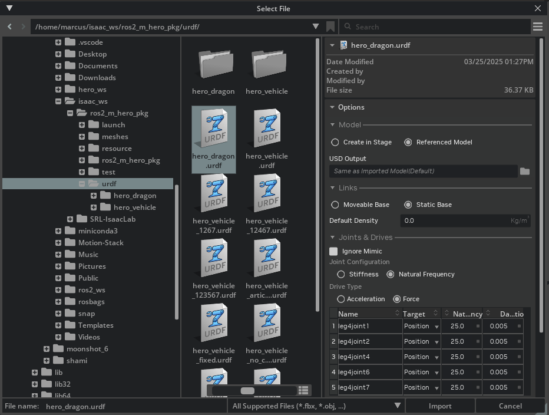

# SRL Moonshot - Isaac Lab 

This repository serves as the working space for Isaac Lab related tasks using the [Manager Based Reinforcement Learning Environment](https://isaac-sim.github.io/IsaacLab/main/source/tutorials/03_envs/create_manager_rl_env.html) format. It functions as an isolated unit that integrates into the Isaac Lab methodology, meaning that all SRL Moonshot related content is contained within this repository. 

> **Note:** Before continuing it is *highly* recommended that you do the great [Isaac Lab tutorials](https://isaac-sim.github.io/IsaacLab/main/source/tutorials/index.html) that the developers themselves have made. The following will assume that you have this level of knowledge.


## The File Structure

**`./descriptions/`** : This directory contains all robot description related files such as URDFs, meshes and USDs. The directory also includes a `/config/` directory that has robot specific configuration details such as joint and actuator parameters used for Isaac Lab (see `moonbot_cfgs.py`) or terrains generator configurations used in the environments.

> **Note:** Robot description files are not part of the GitHub repository to save space, but they should be where you place your descriptions. Go to the SRL Moonshot Google Drive (if you have access) to find relevant files. 

**`./utils/`** : This directory contains utility functions related to integrating this workspace into Isaac Lab such as path utilities.

**`./{EXAMPLE_TASK}/`**: The rest of the directories contain categories of tasks such as:
- **`./locomotion/`**: Learning locomotion with velocity commands
- **`./navigation/`**: Learning to navigate with target commands
- **`./manipulation/`**: Learning to manipulate objects 

These directories each contain custom reward, event, and termination functions, curriculums, terrain configurations, and more that relate to the task at hand. 

> **Note:** Currently, only locomotion tasks have been implemented. If you wish to implement other tasks, it would make sense to model them after the similar task directories in the `manager_based` directory under `isaaclab_tasks`. 

### *Where are the robots at???*
Each of the task directories contain a directory related to each specific robot in the `config`, e.g. `/hero_vehicle/`, `/hero_dragon/`, etc. This means that you may find duplicates of the robot directories but located within separate task directories.

Each robot directory then has its own agent (read: RL algorithm) configurations for the different workflows (read: collection of agents) such as [Stable Baselines3](https://stable-baselines3.readthedocs.io/en/master/) or [RSL-RL](https://github.com/leggedrobotics/rsl_rl).  

## How To Train Your Dragon (or Vehicle)

I will here step you through what it takes to train your own robot using Isaac Lab. It starts from how you get your robot ready for Isaac Lab and ends with how you can make nice visualizations of your robot performing inference with your trained policy.  

### Step 1: Create your robot

The first thing you need to do is to create a `.usd` file describing your robot. This can be done in many ways but I will recommend two. It assumes that you have a URDF and accompanying meshes. Both these methods will create not only a USD file but also a folder called `configuration` that you should have in the same directory as the USD file when you load it. Example:

- usd/
    - robot/
        - hero_vehicle_12467/
            - hero_vehicle.usd
            - configuration/
                - hero_vehicle_base.usd
                - hero_vehicle_physics.usd
                - hero_vehicle_sensor.usd

> **Note**: You will often see a robot name followed by numbers in the repository. This is just my own naming convention that indicates which joints in the leg are articulated. Here leg joint 1, 2, 4, 6, and 7 are articulated, while leg joint 3 and 5 are fixed.

#### Option 1: Use the converter script

Isaac Lab provides a script called `convert_urdf.py`. This script converts a URDF to a USD. It can be called as described [here](https://isaac-sim.github.io/IsaacLab/main/source/how-to/import_new_asset.html#using-urdf-importer). One thing that is important to mention is that you have the option to *not* merge fixed joints using this script. This will give you more freedom to access link properties (as you have more links in the link tree), but at a cost of increased model complexity. 

#### Option 2: Import from Isaac Sim directly

If you open Isaac Sim you can very simply click `File > Import` and select your URDF. A menu like the one below then pops up that allows you to change a few settings and import the URDF. 



> **Note**: This will automatically merge all fixed joints, so you should use Option 1 if you do not want that. 

### Step 2: Define your robot's specifications

After having created your robot you can begin defining more Isaac Lab specific details. This is done using an `ArticulationCfg` as described by the very first [tutorial](https://isaac-sim.github.io/IsaacLab/main/source/how-to/write_articulation_cfg.html). You will here specify the path to the USD file of your robot in the `usd_path`. What is important in the context of Moonshot are the actuator configurations. An example from `VEHICLE_ARTICULATED_CFG` in `moonbot_cfgs.py` is:

```
[...]
actuators = {
        "leg_joints": ImplicitActuatorCfg(
            joint_names_expr=["leg1joint.*"],
            effort_limit=36.11,
            velocity_limit=0.145,
            stiffness=1e6,
            damping=100,
        ),
        "wheel_joints": ImplicitActuatorCfg(
            joint_names_expr=["wheel11_left_joint",
                              "wheel11_right_joint",
                              "wheel12_left_joint",
                              "wheel12_right_joint"],
            effort_limit=136.11,
            velocity_limit=0.5,
            stiffness=0,
            damping=10.0
        ),
    },
[...]
```

> **Hint**: You can use wildcards in the strings for the joint names in many places in Isaac Lab, so here it would configure all joints in the URDF starting with "leg1joint". 

The effort limit, velocity limit, stiffness, and damping are key parts of the robot specification, so they should be set carefully. However, it may be difficult to know the exact values stiffness and damping, so a rule of thumb is high stiffness and medium damping for position controlled joints, while zero stiffness and low to medium damping for velocity controlled joints. 

### Step 3: Set up the environment

Now that your robot is ready to rumble, we can look at setting up the learning environment. There are already two examples of this in `./locomotion/velocity/config/`, which are the Hero Vehicle and Hero Dragon configuration of the Moonbots. This step will simply go through the essential parts of these and how to configure it to your desire.

> **Note**: The environments have been set up in a similar fashion as the example environments that are part of the main Isaac Lab repository, so please refer to those in case of confusion. 

#### The base environment

The environment configurations for robots within a specific task directory all inherit from a base environment. This base environment has all the configurations for the managers defined that are used in the learning process, e.g. `CommandsCfg` or `RewardsCfg`. In the context of the locomotion task, the base environment is `velocity_env_cfg.py`. 


#### The inheritance chain

The environments are defined as classes that each inherit from the previous level. In the case of the Vehicle, we have

```
HeroVehicleFlatEnvCfg(  # flat environment specific to Vehicle
    HeroVehicleRoughEnvCfg( # rough enviroment specific to Vehicle
        LocomotionVelocityRoughEnvCfg # base environment
    )
)
```

#### Customizing your environment

When you would like to set up your own environment, then you simply inherit from base environment class and overload relevant parts with your own, such as changing the underlying function in a reward. You can also choose to remove certain parts, like a specific reward function as is done with the `upright_wheel_bodies` reward for the Dragon in `config/hero_dragon/rough_env_cfg.py`:

```
self.rewards.dof_torques_l2.func = mdp.joint_torques_dragon_l2
self.rewards.upright_wheel_bodies = None
```

Due to the inheritance chain, it is important to keep in mind that these changes will also affect the flat training environment. 

#### The agents

In the `./locomotion/velocity/config/your_robot` directory there is another folder containing *the agents* called `agents`. This folder contains all the reinforcement learning algorithm parameters. In the context of this Moonshot related repository, the only relevant one is the RSL-RL PPO algorithm whose configuration file can be found at `agents/rsl_rl_ppo_cfg.py`

#### The gymnasium environments

Once you have defined your learning environment and your agent, you should then register these two as a Gym environment (see https://gymnasium.farama.org/index.html) in the `__init__.py` in the `./locomotion/velocity/config/your_robot` directory. An example can be found here:

```
gym.register(
    id="Moonshot-Velocity-Flat-Hero-Vehicle-v0",
    entry_point="isaaclab.envs:ManagerBasedRLEnv",
    disable_env_checker=True,
    kwargs={
        "env_cfg_entry_point": f"{__name__}.flat_env_cfg:HeroVehicleFlatEnvCfg",
        "rsl_rl_cfg_entry_point": f"{agents.__name__}.rsl_rl_ppo_cfg:HeroVehicleFlatPPORunnerCfg",
        "skrl_cfg_entry_point": f"{agents.__name__}:skrl_flat_ppo_cfg.yaml",
    },
)
```

#### Modelling the Markov Decision Proces 

So you have set up your environment, but you now want to customize how your robot should interact with that environment. Here is where the Markov Decision Process (MDP) descriptions come in. In the `./locomotion/velocity/` directory there is an `mdp/` directory that contains all related information. You can view this as a database of reusable MDP elements that you can apply in all in your different environments as you see fit. If you want to add a reward function, define it in the `mdp/rewards.py` file and you can later reuse it with `mdp.my_reward_function()`. 

> **Hint**: In the `__init__.py` file in the `mdp/` directory, all the MDP functions defined in the original Isaac Lab directory are imported as well (`IsaacLab/source/isaaclab/isaaclab/envs/mdp`), so any functions not defined here have probably been defined there. 

#### 

### Step 4: Train your policy

If everything has gone well and smooth so far, then the training is very easy to start. Given your gymnasium environment `id` (see example above), you can start your training like this:

```
python scripts/reinforcement_learning/rsl_rl/train.py --task=Moonshot-Velocity-Flat-Hero-Vehicle-v0 --headless
```

For more details you can always refer to the [tutorials](https://isaac-sim.github.io/IsaacLab/main/source/tutorials/03_envs/run_rl_training.html). It is of course recommended to start the training without headless mode and a small number of environments to see that everything is as it should be. 

During training it will among other things export checkpoints of your model according to how you setup your agent. For instance, with the command above these logs can be found in a timestamped folder at `IsaacLab/logs/rsl_rl/hero_vehicle_flat/YYYY-MM-DD_HH-MM-SS`. 


### Step 5: Play your policy

Very similar to training your policy, playing your policy is also done using a simple one-liner.

```
python scripts/reinforcement_learning/rsl_rl/play.py --task=Moonshot-Velocity-Flat-Hero-Vehicle-v0 --load_run=YYYY-MM-DD_HH-MM-SS
```

> **Hint**: You can always just rename the run folder so it has some meaningful name instead of just being a timestamp. Then you just specify `--load_run=your_custom_run_name`.

This will play your trained policy in the same environment as you trained it in. However, it will also use the same environment settings like the number of robots, commands given, etc. So, sometimes it can make sense to define a new environment that is only used for playing a trained policy. This has been done for both Vehicle and Dragon, which would instead be called as:

```
python scripts/reinforcement_learning/rsl_rl/play.py --task=Moonshot-Velocity-Flat-Hero-Vehicle-Play-v0 --load_run=YYYY-MM-DD_HH-MM-SS
```

Once you have played back your policy once, it will automatically export your policy as both a `policy.pt` and `policy.onnx` file in the `exported/` folder. In the `params/` folder you can find details about what environment the policy was trained in, what robot it was trained on, observations, reward functions, and more.


#### Recording robot states during inference

Isaac Lab also supports exporting a recording of robot states during inference. This can be done by adding a Recorder Manager to your environment. In this context, you can do that by simply uncommenting the following line in the `LocomotionVelocityRoughEnvCfg()` class in `velocity_env_cfg.py`.

```
# recorders: RecorderCfg = RecorderCfg()
```

It will export an HDF5 file which you can find more information about how to handle and extract data from in Python at this website [here](https://docs.h5py.org/en/stable/).

### (Optional) Step 6: Record nice footage of your trained robot

To record nice foortage of your robot and trained policy you can add `--video` and `--video_length=X` to the `/play.py` script. This can work both in headless and rendering mode, but I recommend headless once you have figured out the right camera angles to allow for shorter rendering times at higher resolutions. For example:

```
python scripts/reinforcement_learning/rsl_rl/play.py --task=Moonshot-Velocity-Flat-Hero-Vehicle-Play-v0 --load_run=YYYY-MM-DD_HH-MM-SS --video --video_length=X
```

This will export a video in the `videos` folder in the logs directory for the run specified by `--load_run` with length equal to X timesteps. A timestep length is defined in the environment configuration. For instance, if you set `self.decimation = 4` and `self.sim.dt = 0.005`, then a `video_length=3000` would correspond to 60 seconds of video (`3000 * (0.005*4) = 60`). 

You can change the camera view by changing the settings of `sim.viewer` in the environment configuration. As an example, we have the Moon environment `HeroVehicleMoonEnvCfg_PLAY(HeroVehicleRoughEnvCfg)`. Here we have different options for the camera settings.

```
self.viewer.resolution = (2540,1440)
self.viewer.eye = (8.0, 8.0, 4.5) # basic view
```

This would set the resolution of the footage to 2540x1440p and change the viewing angle of the camera. The `viewer.eye` can be seen as the origin of camera which unless specified otherwise will look at origin of the world. If you wanted to have a camera that follows the robot as it moves you can use the following settings instead:

```
# make viewer follow robot
self.viewer.origin_type = "asset_body"
self.viewer.asset_name = "robot"
self.viewer.body_name = "insert_robot_body_name_to_follow"
self.viewer.eye = (2.0, 2.0, 1.0) # for sideways view 
```

What is special about the `HeroVehicleMoonEnvCfg_PLAY()` is that it will not use a generated terrain but a USD file as the ground. This allows for the use of premade terrains that may look a little nicer than procedurally generated ones. You can use USD files instead of a generated terrain by overloading the `self.scene.terrain` like so: 

```
self.scene.terrain = TerrainImporterCfg(
    prim_path="/World/ground",
    terrain_type="usd",
    usd_path = "path_to_usd_file.usd",
    collision_group=-1,
    debug_vis=False,
)
```